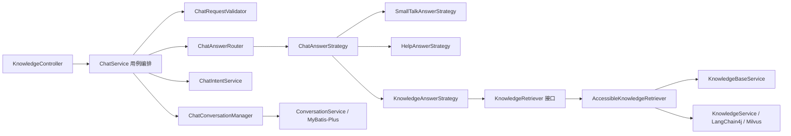

# ChatService 整洁架构重构说明

## 依赖关系

依赖方向从 Web 入口指向应用用例和抽象接口。知识回答策略只依赖 `KnowledgeRetriever`，不直接了解
Milvus、Embedding 或知识库权限列表。增加新的意图时，实现 `ChatAnswerStrategy` 并声明对应
`ChatIntent` 即可，无需修改 `ChatService`。

## 事务边界

`ChatService.chat` 是一次完整的应用用例，使用 `@Transactional(rollbackFor = Exception.class)` 保证
会话创建、用户消息和 AI 消息写入的一致性。当前实现会在数据库事务中等待 RAG 返回；如果后续模型
响应时间明显增长，可演进为“消息先落库为 PROCESSING，模型完成后独立事务更新”的异步状态机。

## 异常协议

应用层抛出携带稳定错误码和 HTTP 状态的 `BusinessException`，`GlobalExceptionHandler` 统一输出
`timestamp/code/message/path`。日志记录错误码和请求路径，不记录用户问题全文，降低敏感信息泄漏风险。
