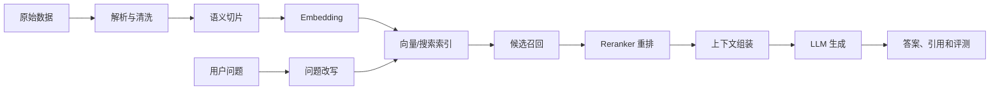
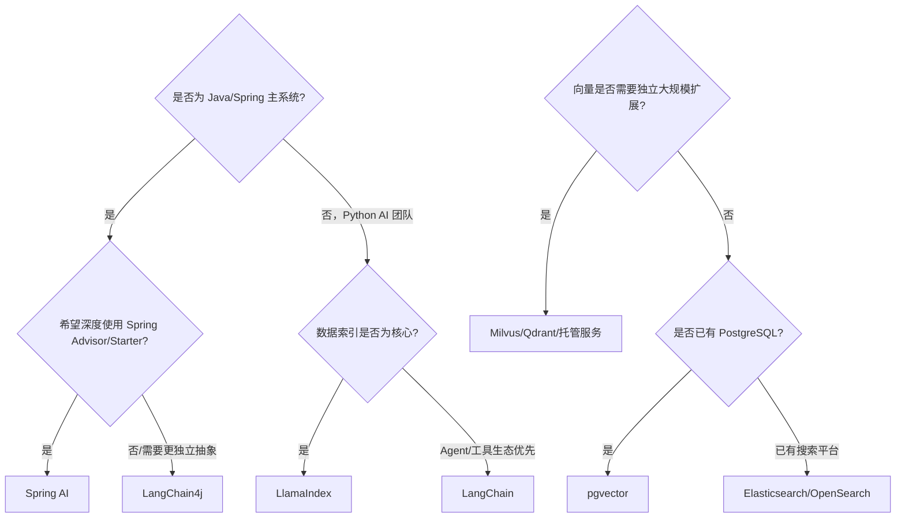

# RAG 主流技术与方案差异

> 适用项目：K·NOVA AI 知识库  
> 更新日期：2026-07-16

## 1. RAG 解决什么问题

大语言模型只了解训练时获得的知识，无法天然掌握企业最新制度、产品文档和私有业务数据。RAG 在模型回答之前从企业数据中检索相关资料，并把资料作为上下文交给模型，从而实现：

- 使用私有和实时知识；
- 降低没有依据的回答；
- 提供文件或段落引用；
- 不重新训练大模型也能更新知识；
- 通过权限过滤控制模型能够看到的内容。

RAG 不是单一框架或数据库，而是一条由数据解析、切片、Embedding、索引、召回、重排和生成组成的工程链路。



## 2. RAG 框架对比

### 2.1 主流框架

| 框架 | 主要语言/生态 | 优势 | 局限 | 更适合 |
| --- | --- | --- | --- | --- |
| LangChain4j | Java | Java 风格统一抽象；模型和向量库覆盖广；可与 Spring Boot 集成；业务代码容易复用 Java 服务 | 社区规模小于 Python LangChain；部分集成使用 beta 版本 | 现有 Java/Spring 企业系统 |
| Spring AI | Java/Spring | Spring 原生自动配置；`ChatClient`、Advisor、ETL、VectorStore、可观测性体系完整 | 与 Spring 绑定更深；高级生态仍在快速演进 | 希望完全遵循 Spring 编程模型的新项目 |
| LangChain | Python/JS | 生态广；模型、工具和 Agent 集成丰富；原型速度快 | 抽象层较多、版本演进快；大型项目需要主动约束边界 | Python AI 团队、Agent 和快速实验 |
| LlamaIndex | Python/TS | 数据连接、索引、检索和查询引擎能力突出；擅长复杂数据 RAG | 企业 Java 集成通常需要独立 Python 服务 | 数据源多、索引策略复杂的 RAG 平台 |
| Haystack | Python | Pipeline 显式；检索、评测和生产部署思路清晰 | Java 生态融合度低，组件数量少于 LangChain | 搜索/NLP 团队及可控 Pipeline |
| 原生 SDK 自研 | 任意 | 依赖少、行为完全可控、性能路径短 | 解析、重试、模型切换、评测和可观测性都要自行建设 | 需求稳定、性能敏感、团队有平台能力 |

### 2.2 LangChain4j 与 Spring AI 的重点区别

二者都是 Java 项目最常见的选择，但侧重点不同：

| 维度 | LangChain4j | Spring AI |
| --- | --- | --- |
| 核心定位 | Java 版统一 AI 抽象和工具箱 | Spring 生态内的统一 AI 应用模型 |
| 编程方式 | `ChatModel`、`EmbeddingModel`、`EmbeddingStore`、AI Services | `ChatClient`、Advisor、`VectorStore`、ETL |
| Spring 依赖 | 可脱离 Spring 单独使用 | 深度依赖 Spring 编程模型 |
| RAG 定制 | 低层接口和高级组件均可使用 | Advisor 和模块化 RAG Flow 更贴合 Spring |
| 模型/向量库切换 | 覆盖面广，接口直观 | 通过 Starter 和属性自动配置更方便 |
| 当前项目迁移成本 | 已经使用，成本最低 | 需要替换模型、向量库和 RAG 调用层 |

本项目继续选择 LangChain4j，不是因为 Spring AI 不适合，而是当前代码已经围绕 `EmbeddingModel`、`EmbeddingStore` 和 `ChatModel` 建立了清晰边界，迁移不会直接提升当前召回质量。若未来团队希望统一使用 Spring AI 的 Advisor、Observability 和 MCP 体系，可以在独立分支进行验证。

## 3. 向量数据库对比

| 方案 | 数据模型 | 优势 | 局限 | 推荐规模/场景 |
| --- | --- | --- | --- | --- |
| Milvus | 专用分布式向量数据库 | 高性能 ANN；标量过滤；索引丰富；可从 Standalone 扩展到分布式 | 需要 etcd、对象存储等组件，运维复杂度高于普通数据库 | 中大型知识库、向量持续增长、高并发 |
| pgvector | PostgreSQL 扩展 | 向量与业务数据同库；ACID、JOIN、备份体系成熟；支持 HNSW/IVFFlat | 超大规模独立扩容能力弱于专用向量数据库 | 已使用 PostgreSQL、中小规模、强事务关联 |
| Elasticsearch/OpenSearch | 搜索引擎 + 向量 | BM25、过滤、聚合和向量混合检索强；搜索运维体系成熟 | 资源消耗较大；纯向量性能和成本未必优于专用库 | 已有 ES、关键词与混合检索重要 |
| Qdrant | 专用向量数据库 | Payload 过滤能力强；部署相对简单；Rust 实现 | 大型企业现有运维和 Java 经验可能少于 ES/PostgreSQL | 中等规模、过滤复杂、追求简洁部署 |
| Weaviate | 向量数据库/语义平台 | Schema、混合检索和模块化能力完整 | 平台概念较多，资源和运维成本需要评估 | 希望获得较完整语义检索平台 |
| Pinecone | 托管向量服务 | 无需自建集群；弹性和可用性由供应商负责 | 成本、网络、数据合规和供应商绑定 | 海外云、团队不想维护向量基础设施 |
| Redis Vector | 内存数据库 + 向量 | 延迟低；可与缓存和实时数据结合 | 内存成本高，超大知识库成本明显 | 实时推荐、短生命周期和高频热数据 |
| 本地 InMemory/File | 进程内存 + 文件 | 零运维、启动快、便于调试 | 暴力检索、单机、不适合并发和大量数据 | 单元测试、本地开发、演示 |

### 3.1 Milvus 与 pgvector 怎么选

选择 pgvector 的典型条件：

- 业务已经使用 PostgreSQL；
- 向量数量不大，希望减少基础设施；
- 需要频繁 JOIN 业务表或强事务一致性；
- 运维团队更熟悉 PostgreSQL。

选择 Milvus 的典型条件：

- 向量规模和查询并发会持续增长；
- 向量检索是系统核心能力；
- 需要独立扩展查询、写入和索引资源；
- 能接受独立向量数据库的运维成本。

K·NOVA 当前采用 MySQL + Milvus：MySQL 管理事务型元数据，Milvus 专注语义检索。这个边界清楚，但部署组件较多；如果实际只有几十万条以内的切片且团队已有 PostgreSQL，pgvector 会是更简单的替代方案。

## 4. 检索方式对比

### 4.1 稠密向量检索

使用 BGE-M3 等模型把问题和文档映射到稠密向量空间，再使用余弦相似度召回。

优势：能够识别同义表达和语义相近内容。  
不足：对精确编号、错误码、SKU、表名和代码符号的召回可能不如关键词检索。

当前项目采用这种方式：BGE-M3 + Milvus COSINE + `knowledgeBaseId` 过滤 + Top 6。

### 4.2 BM25 关键词检索

根据词频和逆文档频率召回，Elasticsearch/OpenSearch 是常见实现。

优势：精确关键词、编号、专有名词和代码检索效果好，结果容易解释。  
不足：不理解同义表达，用户问题与原文措辞不同时容易漏召回。

### 4.3 混合检索

同时执行稠密向量和 BM25，再通过 RRF（Reciprocal Rank Fusion）或加权分数合并。

优势：兼顾语义和精确词，通常比单路召回稳定。  
不足：需要维护两套索引或支持混合检索的引擎，调参与评测复杂度增加。

对于当前仓储流程文档，存在大量 `auditAddStock`、`n_pubm`、`flag=11` 等精确标识，混合检索会比纯向量检索更合适，是下一阶段的优先升级项。

### 4.4 Knowledge Graph RAG

先抽取实体和关系形成知识图谱，再进行路径或子图检索。

优势：适合回答多跳关系、上下游依赖和影响范围问题。  
不足：图谱构建、实体消歧、更新和质量维护成本高。

仓储流程中的“单据—状态—任务—库存动作—回写对象”具有明显关系结构，但现阶段应先把混合检索和重排做好，再评估是否需要 Graph RAG。

### 4.5 Agentic RAG

由模型决定查询改写、选择数据源、多轮检索和结果验证。

优势：可以处理复杂问题和多数据源。  
不足：延迟、费用和不可预测性增加，调试比固定 Pipeline 困难。

适合复杂分析助手，不建议作为所有简单知识问答的默认路径。

## 5. 切片策略对比

| 策略 | 优点 | 缺点 | 适用内容 |
| --- | --- | --- | --- |
| 固定字符/Token | 实现简单、批处理稳定 | 容易切断标题、表格和流程关系 | 普通连续文本、早期原型 |
| 递归分隔符 | 优先按段落、句子切分 | 不理解业务结构 | 通用文档 |
| Markdown 标题切片 | 保留章节路径和主题 | 章节过长时仍需二次切分 | 技术文档、制度文档 |
| 语义切片 | 根据句子向量变化寻找边界 | 计算成本高，结果不易预测 | 长篇非结构化文本 |
| Parent-Child | 小片段召回、大父块提供上下文 | 索引和上下文映射更复杂 | 长文档、需要上下文完整性 |
| 表格/流程图专用切片 | 保留表头、节点和分支关系 | 需要格式识别和专门解析 | 配置表、流程文档、图表 |

当前在线上传使用 `800` 字符、`120` 字符重叠的递归切片；仓储流程离线工具已经采用标题层级、表格整体和 Mermaid 整体切片。建议把离线工具的结构化策略整合进在线上传流程。

## 6. Embedding 模型对比

| 模型类型 | 代表方案 | 优势 | 局限 |
| --- | --- | --- | --- |
| 商业 API | OpenAI Embedding、Voyage、Cohere | 开箱即用、质量稳定、无需部署 | 数据出域、按量费用、网络依赖 |
| 中文/多语言开源 | BGE-M3、E5、GTE | 可私有部署；中文和多语言表现好；成本可控 | 需要模型服务和硬件；需自行压测 |
| 小型本地模型 | bge-small、MiniLM | CPU 可运行、延迟和资源低 | 复杂语义和跨语言能力较弱 |
| 多模态 Embedding | Cohere/Voyage/Gemini/Jina 等多模态模型 | 可统一检索文本和图片 | 成本更高，向量和解析链路更复杂 |

当前选择 BGE-M3 的原因：中文和多语言能力、可通过 Ollama 本地部署、1024 维向量与 Milvus 配合直接。模型一旦更换，维度或向量空间通常会变化，必须新建 Collection 并重新生成全部文档向量。

## 7. Reranker 与普通向量排序的区别

向量数据库使用单个向量分数快速召回，适合从大量片段中找候选；Reranker 同时读取“问题 + 候选片段”进行更精细的相关性判断。

```text
向量召回 Top 30 → Reranker 精排 → 保留 Top 5 → 交给大模型
```

| 维度 | 向量相似度 | Reranker |
| --- | --- | --- |
| 速度 | 快，适合全库检索 | 慢，只适合少量候选 |
| 判断信息 | 独立向量距离 | 同时分析问题和文档 |
| 主要目标 | 提高召回率 | 提高排序准确率 |
| 推荐组合 | 第一阶段召回 | 第二阶段精排 |

对准确性要求较高的企业知识库，Reranker 通常比单纯继续调高 Top K 更有效。

## 8. Naive RAG、Advanced RAG 与 Modular RAG

| 类型 | 处理链路 | 特点 |
| --- | --- | --- |
| Naive RAG | 问题 → 向量召回 → 拼接 → 生成 | 简单、延迟低；当前项目接近此阶段 |
| Advanced RAG | 查询改写 + 混合召回 + 重排 + 上下文压缩 | 准确率更高，是企业知识库的常见目标 |
| Modular RAG | 路由、多数据源、多工具、Graph、Agent、自校验 | 适合复杂助手，但成本和可观测性要求高 |

升级不应直接从 Naive RAG 跳到 Agentic RAG。推荐先建立评测集，再按“结构化切片 → 混合检索 → Reranker → 查询改写”的顺序逐步增加能力。

## 9. 本项目当前方案与推荐目标

| 环节 | 当前实现 | 推荐目标 |
| --- | --- | --- |
| 文档解析 | Apache Tika | Tika + OCR + 版面/表格解析 |
| 切片 | 800/120 递归切片 | 标题、表格、流程图、Parent-Child |
| Embedding | Ollama BGE-M3 | 保留，建立模型评测和批处理服务 |
| 向量库 | dev 文件库 / prod Milvus | 保留，增加索引参数、备份和监控 |
| 召回 | 稠密向量 Top 6 | Dense + BM25 混合召回 Top 30 |
| 排序 | 向量分数 | Cross-Encoder Reranker Top 5 |
| 查询处理 | 原始问题 | 多轮问题改写、缩写和专有词扩展 |
| 上下文 | 直接拼接片段 | 去重、邻接扩展、Token 预算控制 |
| 生成 | DeepSeek V4 Pro | 保留，增加引用结构和无答案策略 |
| 评测 | 暂无 | RAGAS/自建指标 + 人工黄金问题集 |

## 10. 选型决策建议



对 K·NOVA 当前阶段，推荐继续使用：

```text
Spring Boot + LangChain4j + BGE-M3 + Milvus + DeepSeek + Vue 3
```

近期最有价值的技术升级不是更换框架，而是：

1. 将文档向量化改为异步任务；
2. 在线采用结构化切片；
3. 增加 BM25 混合检索；
4. 增加 Reranker；
5. 建立可重复执行的 RAG 评测集。

## 11. 参考资料

- LangChain4j RAG：https://docs.langchain4j.dev/tutorials/rag/
- Spring AI RAG：https://docs.spring.io/spring-ai/reference/api/retrieval-augmented-generation.html
- Spring AI Vector Database：https://docs.spring.io/spring-ai/reference/api/vectordbs.html
- Milvus Architecture：https://milvus.io/docs/architecture_overview.md
- pgvector：https://github.com/pgvector/pgvector
- Vue：https://vuejs.org/guide/introduction
