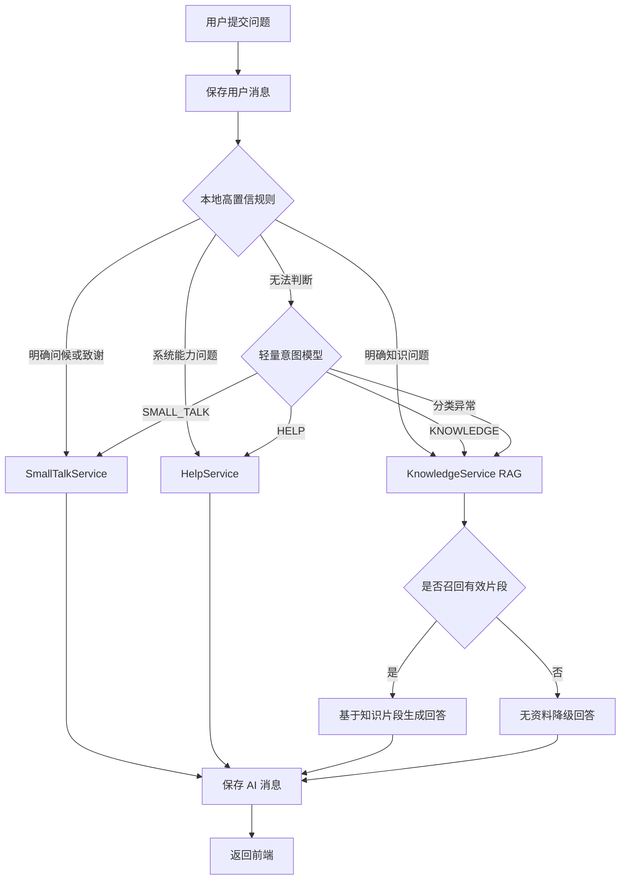

# AI 知识库闲聊路由技术方案

## 1. 背景与目标

当前 `/api/chat` 的所有问题都会执行 Embedding、Milvus 检索和大模型问答。对于“你好”“谢谢”“你是谁”等消息，这会产生三个问题：

- 无意义地调用向量模型和向量数据库，增加响应时间与调用成本。
- 知识库没有相关片段时，容易返回“未找到相关内容”，交互不自然。
- 闲聊、系统帮助和知识问答使用同一提示词，回答风格难以控制。

本方案在保持前端接口不变的前提下，在后端增加意图路由层，实现：

- 高置信度闲聊不访问 Milvus。
- 知识问题继续自动检索当前用户有权限的全部未归档知识库。
- 系统能力问题返回稳定、可配置的产品说明。
- 所有类型的消息继续写入现有会话历史。
- 分类失败时自动降级，不影响正常问答。

## 2. 方案结论

采用“本地规则优先、模型分类兜底、检索结果二次降级”的三级路由方案。



不建议仅用“文本长度”判断闲聊。比如“怎么退款？”很短，但属于知识问题；“你好，请告诉我退款流程”包含问候词，但主体仍是知识问题。

## 3. 意图定义

新增枚举：

```java
public enum ChatIntent {
    SMALL_TALK, // 问候、致谢、告别、简单寒暄
    HELP,       // 询问系统身份、能力、使用方式
    KNOWLEDGE   // 需要检索企业知识库的问题
}
```

第一期不增加 WEATHER、NEWS、CALC 等外部工具意图。系统没有对应工具时，应明确能力边界，避免模型假装已经查询实时信息。

## 4. 分层设计

### 4.1 ChatService

新增统一对话编排服务，Controller 不再直接编排检索和消息保存。

职责：

1. 校验或创建会话。
2. 保存用户消息。
3. 调用 `ChatIntentService` 识别意图。
4. 根据意图调用闲聊、帮助或 RAG 服务。
5. 保存 AI 回答。
6. 返回会话 ID、回答和回答类型。

建议方法：

```java
ChatResult chat(String username, Long conversationId, String question);
```

### 4.2 ChatIntentService

负责规则匹配和模型兜底，不负责生成最终回答。

```java
ChatIntent classify(String question);
```

内部处理顺序：

1. 空值和超长输入校验。
2. 精确短语规则。
3. 复合问题保护。
4. 明确知识特征判断。
5. 低置信度问题交给模型分类。
6. 分类异常默认返回 `KNOWLEDGE`。

默认走知识检索比默认走闲聊更安全，因为本系统的核心定位是企业知识助手。

### 4.3 SmallTalkService

负责问候、致谢和告别。推荐第一期优先返回模板，不必每次调用大模型。

示例：

| 输入类型 | 示例回答 |
|---|---|
| 问候 | 你好，我是 GGBOND AI。你可以直接询问已接入知识库中的内容。 |
| 致谢 | 不客气。如果还有知识库相关问题，可以继续问我。 |
| 告别 | 再见，随时欢迎回来继续查询资料。 |
| 情绪寒暄 | 我状态不错，已经准备好帮你查询知识库了。 |

模板回答具有响应快、稳定和零模型成本的优点。需要更自然的表达时，可以通过配置决定是否调用聊天模型润色。

### 4.4 HelpService

返回产品能力说明，不从 Milvus 检索：

- 可以检索当前用户有权限的全部未归档知识库。
- 可以根据文档片段回答并给出来源。
- 支持 PDF、Word、PPT、TXT、Markdown 等已配置格式。
- 不具备联网搜索、天气和新闻查询能力，除非后续接入相应工具。

### 4.5 KnowledgeService

继续负责现有 RAG 流程：

1. 对问题生成 Embedding。
2. 按知识库 ID 使用 Metadata Filter 独立召回。
3. 合并所有召回片段。
4. 按相似度排序并截取 Top 8。
5. 组装来源与正文。
6. 调用聊天模型生成最终答案。

建议将返回值由 `String` 升级为：

```java
public record RagResult(
        String answer,
        boolean matched,
        List<String> sources,
        int retrievedSegments
) {}
```

这样路由层可以区分“正常知识回答”和“没有召回资料”，并便于后续在前端展示来源。

## 5. 本地规则设计

### 5.1 高置信度闲聊词

仅对完整短句或规范化后完全匹配的内容生效：

```text
你好、您好、嗨、hello、hi
谢谢、多谢、感谢、辛苦了
再见、拜拜、bye
早上好、中午好、下午好、晚上好
```

规范化操作：

- 去除首尾空格。
- 英文转小写。
- 去除结尾的 `。！？!?~`。
- 连续空白压缩成一个空格。

### 5.2 系统帮助词

```text
你是谁
你能做什么
怎么使用
如何上传知识库
支持什么文件
回答来自哪里
```

### 5.3 复合问题保护

以下消息不能因为包含“你好”就识别为闲聊：

```text
你好，请介绍退款流程
您好，Milvus 应该怎么配置
谢谢，另外合同审批需要谁签字
```

实现规则：闲聊关键词仅在整句匹配或去掉称呼后无剩余有效内容时生效。包含明显疑问主体时进入 `KNOWLEDGE` 或模型分类。

### 5.4 知识问题特征

出现以下特征时可直接判定为 `KNOWLEDGE`：

- “如何、怎么、为什么、哪些、流程、规定、配置、文档、制度”等疑问词。
- 消息中包含问号且不是系统身份问题。
- 文本长度较长并包含多个实体或业务术语。
- 引用“公司、项目、产品、合同、流程、手册、文档”等企业知识上下文。

## 6. 模型分类兜底

只有本地规则无法确定时才调用模型，降低额外成本。

推荐分类提示词：

```text
你是消息意图分类器，不回答用户问题。

可选分类：
- SMALL_TALK：纯问候、致谢、告别、无业务内容的寒暄。
- HELP：询问当前 AI 的身份、能力或使用方法。
- KNOWLEDGE：需要从企业知识、文档、制度、流程或业务资料中寻找答案。

要求：
1. 只输出一个分类名称。
2. 包含问候语但同时提出业务问题时，输出 KNOWLEDGE。
3. 无法确定时输出 KNOWLEDGE。

用户消息：{{question}}
```

模型输出需要使用白名单解析：

```java
try {
    return ChatIntent.valueOf(result.trim().toUpperCase());
} catch (Exception ignored) {
    return ChatIntent.KNOWLEDGE;
}
```

## 7. 接口设计

前端接口保持不变：

```http
POST /api/chat
Content-Type: application/json

{
  "conversationId": 12,
  "question": "你好"
}
```

建议响应增加 `answerType` 和 `sources`，旧前端忽略新增字段也不会受影响：

```json
{
  "conversationId": 12,
  "answer": "你好，我是 GGBOND AI。有什么知识库问题可以帮你？",
  "answerType": "SMALL_TALK",
  "sources": []
}
```

知识回答示例：

```json
{
  "conversationId": 12,
  "answer": "退款申请需要经过……",
  "answerType": "KNOWLEDGE",
  "sources": ["售后服务流程.docx"]
}
```

## 8. 核心编排伪代码

```java
@Transactional
public ChatResult chat(String username, Long conversationId, String question) {
    ChatConversation conversation = conversationId == null
            ? conversationService.create(0L, username, question)
            : conversationService.requireOwned(conversationId, username);

    conversationService.addMessage(conversation.getId(), "user", question);
    ChatIntent intent = chatIntentService.classify(question);

    AnswerResult result = switch (intent) {
        case SMALL_TALK -> smallTalkService.answer(question);
        case HELP -> helpService.answer(question);
        case KNOWLEDGE -> {
            List<Long> baseIds = knowledgeBaseService.list(username).stream()
                    .filter(item -> !item.profile().isArchived())
                    .map(item -> item.base().getId())
                    .toList();
            yield knowledgeService.ask(baseIds, question);
        }
    };

    conversationService.addMessage(conversation.getId(), "assistant", result.answer());
    return new ChatResult(conversation.getId(), result.answer(), intent, result.sources());
}
```

## 9. 异常与降级策略

| 异常 | 降级方式 |
|---|---|
| 意图模型超时 | 默认按 `KNOWLEDGE` 处理 |
| Embedding 服务异常 | 返回“知识检索服务暂时不可用”，不伪造答案 |
| Milvus 异常 | 记录 traceId，返回可重试提示 |
| 没有可访问知识库 | 引导管理员创建知识库或为用户授权 |
| 没有相关片段 | 明确说明未找到资料，可建议换一种问法 |
| 聊天模型异常 | 保存用户消息，返回服务异常提示，不保存伪回答 |
| 问题为空 | Controller 参数校验直接返回 400 |
| 问题过长 | 限制长度，例如 4,000 字符，超过返回 400 |

## 10. 配置建议

```yaml
app:
  chat-routing:
    enabled: true
    model-fallback-enabled: true
    max-question-length: 4000
    intent-timeout-seconds: 5
    rag-min-score: 0.55
    rag-max-results-per-base: 6
    rag-final-top-k: 8
```

规则词建议放在代码内的不可变集合，业务可配置需求明确后再迁移到 YAML 或数据库，避免第一期引入不必要的后台管理复杂度。

## 11. 日志与指标

日志不能记录密码、Token 和完整敏感文档内容。建议为每次问答记录：

```text
traceId
username
conversationId
intent
ruleMatched
accessibleBaseCount
retrievedSegmentCount
embeddingDurationMs
vectorSearchDurationMs
chatModelDurationMs
totalDurationMs
status
```

建议关注：

- 闲聊规则命中率。
- 意图模型调用比例。
- `KNOWLEDGE` 无召回比例。
- 各意图平均响应时间。
- 用户对知识回答的追问率。
- 分类错误反馈数量。

## 12. 测试用例

### 12.1 闲聊

```text
你好                    -> SMALL_TALK
谢谢                    -> SMALL_TALK
再见                    -> SMALL_TALK
你今天怎么样            -> SMALL_TALK 或模型分类
```

### 12.2 系统帮助

```text
你是谁                  -> HELP
你能做什么              -> HELP
支持上传什么文件        -> HELP
答案是从哪里来的        -> HELP
```

### 12.3 知识问答

```text
怎么退款                -> KNOWLEDGE
合同审批流程是什么      -> KNOWLEDGE
你好，请介绍退款流程    -> KNOWLEDGE
谢谢，另外如何配置 Milvus -> KNOWLEDGE
```

### 12.4 边界情况

```text
空字符串                -> 400
只有标点                -> 400 或 SMALL_TALK，建议 400
超过 4000 字符          -> 400
意图模型返回其他文本    -> KNOWLEDGE
用户无可访问知识库      -> 明确引导提示
```

## 13. 实施计划

### 第一阶段：低风险版本

1. 新增 `ChatIntent`、`ChatIntentService`、`SmallTalkService`、`HelpService`。
2. 新增 `ChatService`，迁移 Controller 中的对话编排代码。
3. 实现高置信度规则，暂时关闭模型分类兜底。
4. 保持 `/api/chat` 请求和响应兼容。
5. 补充单元测试和接口日志。

### 第二阶段：模型分类

1. 对无法判断的消息启用轻量模型分类。
2. 增加超时、白名单解析和默认降级。
3. 统计规则命中率与模型分类比例。

### 第三阶段：回答来源与反馈

1. `KnowledgeService` 返回结构化来源。
2. 前端展示引用文件。
3. 增加“回答有帮助/无帮助”反馈。
4. 根据误分类数据持续调整规则。

## 14. 风险说明

- 规则过宽会把真实知识问题误判为闲聊，因此规则必须只处理高置信度完整短语。
- 每条消息都调用意图模型会增加延迟和成本，因此模型只能作为兜底。
- 闲聊模型不应回答实时天气、新闻、法律结论等未接入能力。
- 对话历史未来参与上下文时，需要防止上一轮闲聊影响下一轮知识检索问题。
- 当前对话表使用 `knowledge_base_id = 0` 表示全局问答，后续建议增加明确的 `scope` 字段替代特殊值。

## 15. 验收标准

- “你好、谢谢、再见”不调用 Embedding 和 Milvus。
- “你好，请介绍退款流程”仍执行知识检索。
- 闲聊、帮助、知识回答均能正常保存到会话历史。
- 意图识别异常不会导致接口失败。
- 用户无知识库权限时返回明确提示。
- 原有前端无需修改即可继续使用 `/api/chat`。
- 日志可以区分回答意图和各阶段耗时，但不记录敏感正文。
