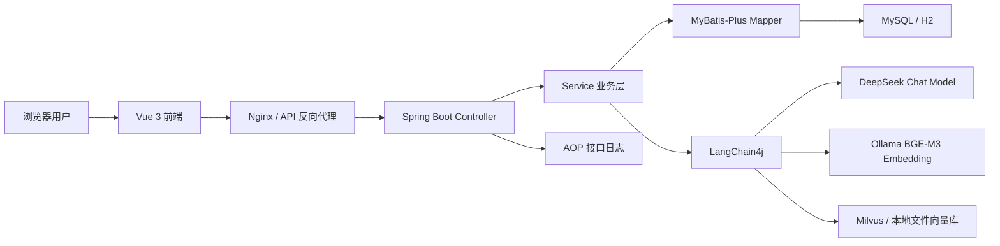
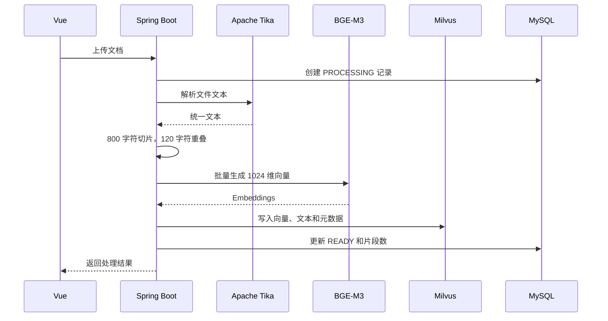
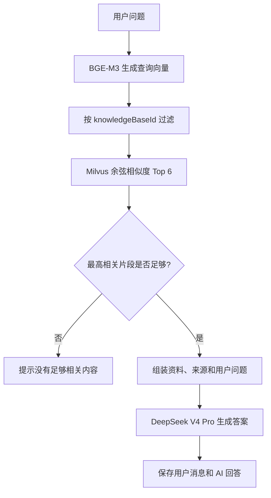

# K·NOVA AI 知识库技术架构说明

> 文档版本：1.0  
> 对应项目版本：0.1.0  
> 更新日期：2026-07-16

RAG 框架、向量数据库、检索策略、Embedding 与 Reranker 的横向比较见 [RAG 主流技术与方案差异](RAG_TECHNOLOGY_COMPARISON.md)。

## 1. 项目定位

K·NOVA 是一个面向企业内部文档的 RAG（Retrieval-Augmented Generation，检索增强生成）知识库。系统将 PDF、Word、PPT、TXT、Markdown 等文件解析为文本，切分后生成向量并写入向量库；用户提问时先检索相关片段，再把检索结果连同问题交给大模型生成答案。

当前系统已经包含：

- JWT 登录认证；
- 知识库和文档维护；
- 文档解析、切片、Embedding 和 Milvus 检索；
- DeepSeek 对话生成；
- 对话及消息持久化、历史对话切换和删除；
- 请求入参、出参、耗时、异常及 traceId 日志；
- `dev` 和 `prod` 两套运行环境；
- Vue 响应式管理界面和 Docker Compose 部署文件。

## 2. 总体架构



系统采用前后端分离的模块化单体架构。当前业务规模下，模块化单体比微服务更容易开发、部署、排错和保证事务一致性；Controller、Service、Mapper 和 AI 基础设施之间仍保持清晰边界，未来可以按文档处理、检索服务或模型网关拆分。

## 3. 项目目录结构

```text
Demo-AI/
├─ backend/                         Spring Boot 后端
│  ├─ src/main/java/com/knova/
│  │  ├─ config/                    安全、模型、向量库环境配置
│  │  ├─ controller/                REST API，请求和响应转换
│  │  ├─ domain/                    数据库实体
│  │  ├─ repository/                MyBatis-Plus Mapper
│  │  ├─ service/                   认证、知识库、文档、RAG、对话业务
│  │  └─ log/                       @ApiLog、日志切面、traceId 过滤器
│  ├─ src/main/resources/
│  │  ├─ application.yml            公共配置
│  │  ├─ application-dev.yml        H2 + 本地文件向量库
│  │  ├─ application-prod.yml       MySQL + Milvus
│  │  ├─ schema.sql                 关系数据库表结构
│  │  └─ logback-spring.xml         控制台及滚动文件日志
│  ├─ pom.xml                       Maven 依赖与构建配置
│  └─ Dockerfile                    后端容器构建
├─ frontend/                        Vue 3 前端
│  ├─ src/components/               可复用组件，如聊天输入框
│  ├─ src/views/                    登录页和知识库工作台
│  ├─ src/router/                   页面路由和登录守卫
│  ├─ src/api.ts                    Axios 实例及 JWT 拦截器
│  ├─ src/style.css                 全局视觉样式
│  ├─ package.json                  前端依赖及构建脚本
│  └─ Dockerfile                    Nginx 静态站点构建
├─ tools/                           文档语义切片等离线工具
├─ docs/                            项目技术和使用文档
├─ docker-compose.yml               MySQL、Milvus、后端和前端编排
├─ .env.example                     环境变量模板
└─ README.md                        快速开始
```

## 4. 后端分层职责

### 4.1 Controller

Controller 只负责 HTTP 协议相关工作，包括接收参数、调用业务层和返回 DTO，不直接访问数据库。当前主要入口为：

- `AuthController`：登录；
- `KnowledgeController`：知识库、文档、对话和问答接口。

所有业务接口通过 `@ApiLog` 记录请求和响应。密码、Token、API Key 以及上传文件正文不会写入日志。

### 4.2 Service

| 服务 | 职责 |
| --- | --- |
| `UserService` | 用户查询、密码校验、JWT 签发、默认管理员初始化 |
| `KnowledgeBaseService` | 知识库 CRUD、文档查询、知识库级联删除 |
| `KnowledgeService` | Tika 解析、文本切片、Embedding、向量写入、RAG 检索和回答 |
| `ConversationService` | 对话和消息持久化、用户数据隔离、历史记录删除 |
| `VectorStorePersistence` | 屏蔽本地文件向量库与正式 Milvus 的持久化差异 |

### 4.3 Mapper 与关系数据库

Mapper 继承 MyBatis-Plus `BaseMapper`，提供常用 CRUD；动态查询使用 Lambda Wrapper，避免把字段名写成字符串。关系数据库保存强结构、需要事务和精确查询的数据：

- 用户；
- 知识库元数据；
- 文档处理状态；
- 对话；
- 对话消息。

文档向量不放入关系数据库，避免大规模浮点数组影响普通业务查询和数据库维护。

## 5. RAG 数据流程

### 5.1 文档入库



每个 `TextSegment` 包含 `knowledgeBaseId`、`documentId` 和 `fileName` 元数据。检索时使用 `knowledgeBaseId` 隔离知识库，删除文档时使用 `documentId` 精确清理向量。

### 5.2 用户问答



当前最低相关度为 `0.55`。这个值不是通用最优值，应使用真实问题集做召回率、准确率和无答案率评估后调整。

## 6. 主要技术选型及原因

### 6.1 Java 17 + Spring Boot 3.5

Spring Boot 适合企业 Java 应用，提供 Web、安全、配置、校验、监控、AOP 和容器化的统一工程模型。Java 17 是 LangChain4j 支持的最低 Java 版本，也是成熟的 LTS 基线。

选择原因：

- 企业团队通常具备成熟的 Java 开发、监控和运维体系；
- Spring Security、Actuator、Validation 和依赖注入可直接复用；
- 适合承载认证、事务、文档管理等传统业务，同时通过 LangChain4j 接入 AI；
- 当前使用 Spring Boot 3.5 而不是直接升级 4.x，是为了保持第三方 Starter 和现有 Java 生态兼容性。

### 6.2 MyBatis-Plus 3.5

选择 MyBatis-Plus 而不是 JPA，是因为该项目需要清晰可控的 SQL、动态条件和后续可能出现的仓储报表查询。`BaseMapper` 减少简单 CRUD 模板代码，Lambda Wrapper 又能保留字段重构安全性。

适用边界：复杂查询应迁移到 XML 或专用查询对象，不应在 Service 中持续堆叠超长 Wrapper；生产环境数据库结构应由 Flyway/Liquibase 管理，而不是长期依赖 `schema.sql`。

### 6.3 LangChain4j 1.17

LangChain4j 提供统一的 `ChatModel`、`EmbeddingModel` 和 `EmbeddingStore` 抽象，使 DeepSeek、Ollama、Milvus 与业务代码解耦。官方同时提供 Spring Boot、RAG、模型和多种向量库集成，适合 Java 技术栈直接构建 AI 应用。

当前项目选择显式 Bean 配置而非完全依赖 Starter 自动配置，是为了清楚拆分聊天模型与 Embedding 模型，并通过 Spring Profile 切换向量存储。

### 6.4 DeepSeek V4 Pro + BGE-M3

- `deepseek-v4-pro` 负责最终答案生成，通过 OpenAI Chat Completions 兼容协议接入；
- `bge-m3` 负责 Embedding，通过本机 Ollama 的 OpenAI 兼容端点调用，输出 1024 维向量。

将聊天和 Embedding 拆开是必要设计：生成模型关注推理和表达，Embedding 模型关注语义空间和召回质量。BGE-M3 更适合中文及多语言知识检索，本地运行还可以减少文档内容发送给外部服务的范围。

### 6.5 Milvus

Milvus 是专门用于向量相似度搜索的数据库，支持向量和标量过滤、删除及多种索引，适合作为生产 RAG 检索层。当前项目使用余弦相似度，并通过元数据过滤实现知识库隔离。

选择原因：

- 面向高维向量检索设计，而不是把向量能力勉强附加到普通业务表；
- Standalone 便于当前部署，后续可以向分布式架构演进；
- 计算与存储解耦架构适合数据量和并发持续增长的场景；
- LangChain4j 有直接集成，支持元数据、过滤和删除。

本地开发使用 `InMemoryEmbeddingStore` 加文件持久化而非 Milvus Lite。Milvus Lite 当前以 Python/PyMilvus 方式集成，本项目是 Java 应用，本地文件存储更轻且无需额外 Python 服务。

### 6.6 Apache Tika

Tika 为不同办公文档提供统一文本抽取接口，减少分别维护 PDF、Word、PPT 解析器的成本。它适合作为通用文档入口，但扫描 PDF、复杂表格和流程图仍需要 OCR、版面分析或视觉模型增强。

### 6.7 Vue 3 + TypeScript + Vite

Vue 3 的 Composition API 和单文件组件适合构建交互密集的管理后台；TypeScript 提供接口数据类型检查；Vite 提供快速开发启动和生产构建。Axios 统一处理 API 地址与 JWT，Vue Router 负责登录守卫。

选择原因：

- 学习和维护成本适中，适合企业后台；
- 响应式状态与组件模型适合聊天、上传状态和知识库切换；
- TypeScript 能尽早发现接口字段变化；
- 前端可以独立部署为 Nginx 静态资源。

Pinia 已作为依赖引入，但当前页面状态仍以组件内 `ref` 为主。对话共享、用户信息和跨页面缓存增多后，应迁移到 Pinia Store。

### 6.8 JWT、AOP 日志与 traceId

JWT 适合当前前后端分离和无状态 API。AOP 日志避免每个 Controller 重复编写日志代码，`@ApiLog` 提供业务名称和入参/出参开关；traceId 能把一次请求的入口、业务日志和异常关联起来。

生产环境仍应补充 Refresh Token、账号禁用、密钥轮换、RBAC、审计日志独立存储，以及日志平台集中检索。

### 6.9 Docker Compose

Compose 将 MySQL、etcd、MinIO、Milvus、后端和前端放在一套可重复环境中，适合开发联调、演示和单机部署。正式高可用环境应逐步迁移到 Kubernetes、托管数据库和对象存储，而不是将 Compose 当作最终集群方案。

## 7. 环境划分

| Profile | 关系数据库 | 向量存储 | 典型用途 |
| --- | --- | --- | --- |
| `dev` | H2 文件数据库 | 本地 JSON 向量文件 | IDEA/Maven 本地开发 |
| `prod` | MySQL | Milvus Standalone/Cluster | 测试、预生产和正式部署 |

模型配置与 Profile 解耦：DeepSeek 和 Ollama 地址均可通过环境变量覆盖。密钥只允许放在环境变量或密钥管理系统中，不能提交到 YAML、源码或镜像。

## 8. 当前设计边界

当前版本适合 MVP、内部试用和中小规模知识库，但以下能力尚未达到大型生产系统要求：

1. 文档解析和向量化仍在 HTTP 请求线程内，大文件会长时间占用线程；
2. 原始文件没有持久化到 MinIO，无法下载、重建或追踪文件版本；
3. 文档更新缺少版本号、增量重建和幂等任务；
4. RAG 只有单路向量召回，没有关键词检索、重排和问题改写；
5. 对话上下文已保存，但当前模型请求只使用本轮问题和检索资料；
6. JWT 只有单一访问令牌，缺少完整的 RBAC 和租户隔离；
7. `schema.sql` 不适合长期管理正式数据库版本；
8. 缺少后端自动化测试、RAG 评测集和端到端测试。

## 9. 推荐演进路线

### 第一阶段：可靠性

- 使用 Flyway 管理数据库版本；
- 将文档处理改为异步任务，增加进度、失败重试和幂等键；
- 原始文档写入 MinIO，并记录 SHA-256 防止重复上传；
- 增加单元测试、接口测试和 Testcontainers 集成测试；
- 增加全局异常响应结构和参数校验。

### 第二阶段：检索质量

- 增加 Markdown 标题、表格和流程图语义切片；
- 引入 BM25 + 向量混合检索；
- 增加 Reranker、查询改写和相邻片段扩展；
- 建立包含标准答案、引用和无答案问题的离线评测集；
- 根据评测结果调节切片长度、重叠、Top K 和最低分数。

### 第三阶段：企业能力

- 增加组织、角色、知识库权限和租户隔离；
- 接入 LDAP、OIDC、钉钉或企业微信 SSO；
- 增加配额、限流、敏感信息检测和内容审计；
- 接入 Prometheus、OpenTelemetry 和集中日志平台；
- 数据规模增长后将 Milvus Standalone 升级为集群或托管服务。

## 10. 参考资料

- Spring Boot：https://spring.io/projects/spring-boot/
- Vue 3：https://vuejs.org/guide/introduction
- LangChain4j：https://docs.langchain4j.dev/intro/
- LangChain4j RAG：https://docs.langchain4j.dev/tutorials/rag/
- Milvus 架构：https://milvus.io/docs/architecture_overview.md
- Milvus 部署模式：https://milvus.io/docs/install-overview.md
- MyBatis-Plus：https://baomidou.com/
- Apache Tika：https://tika.apache.org/
